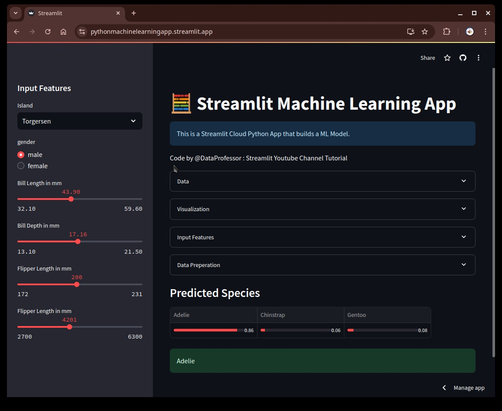

#  🧮 Streamlit Machine Learning App

 

This is a project repository created to follow along with the Streamlit Tutorial on making a Machine Learning App with Streamlit and Python. Credits for the tutorial and code go to [Data Professor](https://github.com/dataprofessor).

**Live Preview:**

## Screenshot

## Usage

Here are the general steps to use the app:

1.**Open Sidebar Input Section**
2. **Choose the island:** Select the island where the penguin was found from the dropdown menu. 
3. **Select gender:** Choose the gender of the penguin (male or female).
4. **Enter measurements:** Input the following measurements for the penguin:
   * Bill length (mm)
   * Bill depth (mm)
   * Flipper length (mm)
   * Body mass (g)
5. **View prediction:** The app will display the predicted species of the penguin along with the probabilities for each possible species.

## GitHub Codespaces

